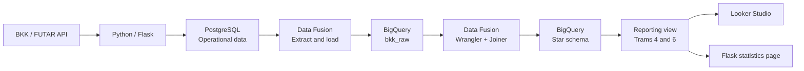

# BKK Delay Data Warehouse

An end-to-end data engineering project that turns Budapest public transport observations into an analytical warehouse. Reporting focuses on **trams 4 and 6**: delay patterns by stop, route, day, and time of day.

**Stack:** Python / Flask, PostgreSQL, Google Cloud Data Fusion, Wrangler, BigQuery, Looker Studio.

## Architecture



## What It Demonstrates

- **Source modeling:** normalized PostgreSQL tables for routes, stops, collection runs, and observations, with duplicate protection during collection.
- **ETL:** three staging pipelines, two dimension pipelines, and a fact pipeline that transforms raw observations directly with Wrangler and dimension joins.
- **Warehouse design:** a delay-observation fact table with date, route, and stop dimensions; date partitioning and route/stop clustering in BigQuery.
- **Analytics:** a shared reporting view powers Looker Studio and the Flask statistics page, covering delay KPIs, stop rankings, trends, and delay categories.
- **Validation:** the recorded warehouse run produced **4,204 facts**, matching the usable source rows, with no null dimension keys or duplicate dimension keys. This is a project snapshot, not a live metric.

The warehouse and dashboard milestones are complete. Scheduled incremental loading is documented as the next extension; successful scheduled runs have not yet been recorded.

## Explore the Project

| Area | Entry point |
|---|---|
| Model, pipeline logic, console setup, and incremental design | [Technical guide](docs/warehouse.md) |
| Operational database | [PostgreSQL schema](sql/create_postgresql_tables.sql) |
| Warehouse tables and date dimension | [Warehouse setup](sql/warehouse_setup.sql) |
| Shared reporting layer | [Dashboard view](sql/dashboard_view.sql) |
| App analytics | [SQL queries](sql/bigquery_analytics_queries.sql) and [BigQuery repository](bkk_delays/bigquery_repository.py) |
| Data quality | [Warehouse checks](sql/warehouse_checks.sql) |

The repository contains application code, SQL, and the pipeline build guide. Data Fusion pipelines are configured in the console; deployable pipeline exports and source data are not included.

## Run Locally

Python 3.12+ recommended. From the repository root on Windows:

```powershell
python -m venv .venv
.\.venv\Scripts\python -m pip install -e ".[dev]"
Copy-Item .env.example .env
.\.venv\Scripts\python -m bkk_delays
```

Open `http://127.0.0.1:5000`. Set `BKK_API_KEY` in `.env` for live searches. Database integrations are disabled by default; without BigQuery, statistics use the latest search in memory, not warehouse data.

To enable persistence and warehouse analytics, configure PostgreSQL and Google Cloud credentials as described in the [technical guide](docs/warehouse.md#application-configuration). Keep credentials and data exports out of Git.

```powershell
.\.venv\Scripts\python -m pytest -q
```

Tests cover API parsing, collection, persistence, analytics mapping, and Flask routes using mocked external services. They do not provision or validate a live Google Cloud deployment.

## Scope

These are sampled departure predictions, not measured arrival times or a complete network-wide punctuality dataset. The warehouse excludes null and negative delays; conclusions therefore apply to the retained observations, not all BKK journeys. This is an independent educational project, not an official BKK service.
