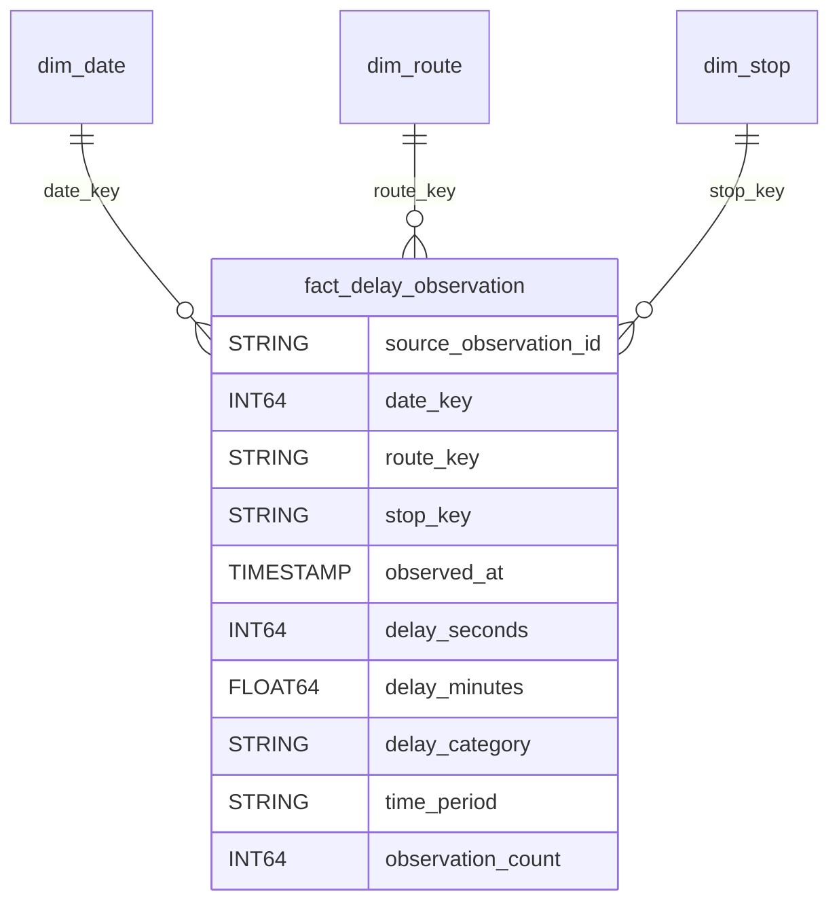
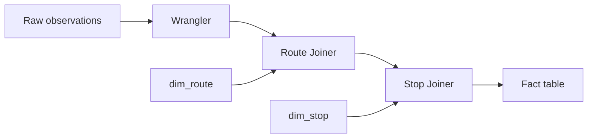

# Warehouse Technical Guide

The project separates operational collection from analytical workloads. Python collects BKK/FUTAR departure predictions into PostgreSQL; Cloud Data Fusion loads and transforms them into BigQuery. Looker Studio and the Flask app read the same reporting view.

## Data Model

One fact represents **one collected departure observation**, not one unique journey. Repeated observations of a trip can be separate facts. `source_observation_id` preserves the PostgreSQL observation ID for traceability and incremental upserts.



| Table | Key and purpose |
|---|---|
| `dim_date` | Integer `YYYYMMDD`; calendar attributes and weekday/weekend grouping |
| `dim_route` | Stable source route ID; route number, name, and transport type |
| `dim_stop` | Stable source stop ID; stop name and coordinates |
| `fact_delay_observation` | Delay measures, dimension keys, timestamps, and source context |

The fact table is partitioned by `DATE(observed_at)` (UTC) and clustered by `route_key, stop_key`. Route and stop dimensions use source keys and full refreshes, not historical slowly changing dimensions. Logical relationships are validated with SQL rather than enforced foreign keys.

## Console Build Order

Prerequisites: a reachable PostgreSQL instance, a Cloud Data Fusion instance with PostgreSQL and BigQuery plugins, and service identities authorized for the source database, BigQuery jobs/datasets, and the pipeline's staging storage. Use compatible regions and restrict access to the required resources. Cloud resources incur charges.

1. In **Cloud SQL Studio** (or your PostgreSQL SQL editor), run [the source schema](../sql/create_postgresql_tables.sql). Populate it through the Python collector or Flask searches. Inspect the source with [the audit SQL](../sql/01_postgres_source_audit.sql).
2. In **BigQuery Studio**, replace `PROJECT_ID` in [the dataset bootstrap](../sql/02_bigquery_bootstrap.sql) and run it to create `bkk_raw` and `bkk_dw` in `EU`.
3. In **Cloud Data Fusion > Studio**, create the three batch staging pipelines below. Configure the PostgreSQL connection through the UI and select BigQuery sinks in `bkk_raw`. Validate, preview, deploy, and run each pipeline.
4. In **BigQuery Studio**, run [warehouse_setup.sql](../sql/warehouse_setup.sql) against the full raw history. It builds `dim_date` and creates the other empty targets without dropping existing tables.
5. In **Data Fusion Studio**, build and run `p04_dim_route`, then `p05_dim_stop`, then `p06_fact_delay`. Use table-based BigQuery sources, not SQL query sources.
6. In **BigQuery Studio**, run [warehouse_checks.sql](../sql/warehouse_checks.sql), then [dashboard_view.sql](../sql/dashboard_view.sql). Replace `PROJECT_ID` in both files.
7. In **Looker Studio**, create a report, add the BigQuery connector, and select `bkk_dw.v_delay_dashboard`. Use `calendar_date` as the date-range dimension.

### Staging Pipelines

| Pipeline | PostgreSQL source | BigQuery target |
|---|---|---|
| `p01_raw_routes` | `transit_data.routes` | `bkk_raw.routes` |
| `p02_raw_stops` | `transit_data.stops` | `bkk_raw.stops` |
| `p03_raw_delay_observations` | `transit_data.delay_observations` | `bkk_raw.delay_observations` |

For the delay source, use this PostgreSQL query and one input split:

```sql
SELECT id AS observation_id, collection_run_id, route_id, stop_id,
       trip_id, headsign, direction_id,
       CAST(stop_sequence AS BIGINT) AS stop_sequence,
       created_at, scheduled_departure, predicted_departure,
       CAST(delay_seconds AS BIGINT) AS delay_seconds,
       delay_category, duplicate_key
FROM transit_data.delay_observations;
```

Keep `created_at` unchanged in raw staging. Match the plugin output schema to the sink: BigQuery `INTEGER` is `INT64`, while Avro distinguishes `int` from `long`. The PostgreSQL casts above and Wrangler `long` conversions avoid that mismatch.

### Dimension and Fact Pipelines

Open Wrangler **Power Mode** and use the recipes in [pipelines/](../pipelines/). Preview timestamp types and output schemas before deploying; plugin versions can differ.

| Pipeline | Source and transformation |
|---|---|
| `p04_dim_route` | Raw routes; copy `id` into both route keys, `short_name` into `route_number`, and build `route_name = route_type + ' line ' + route_number` |
| `p05_dim_stop` | Raw stops; copy `id` into both stop keys, rename the stop name, and convert coordinates to double |
| `p06_fact_delay` | Raw observations directly; filter, derive measures, then inner-join route and stop dimensions |



Filter out rows with null `created_at`, null `delay_seconds`, or negative `delay_seconds` before Wrangler. Join `route_id = source_route_id` and `stop_id = source_stop_id`; retain only the dimension keys from those inputs. Use [the final projection recipe](../pipelines/fact_output.wrangler) to remove helper columns before the sink. The date key is calculated in Wrangler; the date dimension itself is generated in SQL.

The initial-load sinks use truncate/replace behavior. Rerun them only with complete source inputs; never send a partial incremental batch to a production fact sink in replace mode.

| Derived field | Rule |
|---|---|
| `observed_at` | Copy raw `created_at` |
| `delay_minutes` | `delay_seconds / 60.0` |
| `delay_category` | 0-60s: on time; 61-180s: minor; 181-300s: significant; above 300s: severe |
| `time_period` | Hours 06-09: morning peak; 15-18: afternoon peak; otherwise: other period |
| `observation_count` | Constant 1 |

**Timezone check:** the recorded Wrangler recipe extracts date/hour components directly from `created_at`. Confirm the plugin interprets these in `Europe/Budapest` before using the buckets; do not assume a UTC timestamp has already been converted. The reporting view explicitly converts timestamps for hourly analysis. The quality SQL detects date-key and time-period mismatches so they can be corrected in Wrangler and reloaded.

## Reporting and Validation

The reporting view joins all three dimensions and filters `route_number IN ('4', '6')`. In Looker Studio, use average delay and maximum delay scorecards, route/stop comparisons, daily and hourly trends, a category breakdown, and date/route/stop filters. Aggregate delay minutes with **AVG**, observations with **SUM**, and delayed share as `SUM(delayed_count) / SUM(observation_count)`; delayed means more than 60 seconds.

The app's `/statistics` page executes [named analytics queries](../sql/bigquery_analytics_queries.sql) against the same view. It renders KPIs, stop rankings, daily and combined hourly trends, category counts, and a time-period matrix; route comparison is in Looker Studio.

Recorded initial validation: **4,204 usable raw rows and 4,204 facts**, with 11 date rows, 17 routes, and 27 stops. Null fact keys and duplicate dimension keys were zero. These warehouse-wide counts are not the smaller tram-4/6 reporting count. The included quality SQL also checks duplicates, unresolved dimensions, and local-time consistency; those additional checks are not claimed as previously verified.

## Scheduled Incremental Loading

This extension is designed but its execution evidence is not yet complete. The intended console configuration is:

1. Create separate raw and fact incremental landing tables in **BigQuery Studio**, with schemas matching their full tables.
2. In **Data Fusion Studio**, copy the observation pipeline and restrict extraction to `created_at >= NOW() - INTERVAL '2 days'`. Replace only the incremental landing table on each run.
3. In **BigQuery Studio**, prepare a `MERGE` into raw history keyed by `observation_id`. Deduplicate the batch using `ROW_NUMBER()` per ID before the merge. Update matched rows and insert new ones; extend `dim_date` for new dates.
4. Refresh the small route and stop dimensions. Copy the fact pipeline to read the incremental raw table and write to the incremental fact table. Merge the results into the full fact table using `source_observation_id`.
5. In **Data Fusion > Pipeline > Schedule**, schedule the batch pipelines. In **BigQuery Studio > Schedule**, schedule the merge queries after their producers. Record successful refresh timestamps and statuses in `etl_control`.
6. Manually validate a complete cycle, then rerun the same window: fact IDs should remain unique, counts should reconcile, and the dashboard should show the newest observation.

The two-day overlap tolerates recent late records and repeat loads, but requires a backfill after longer outages or older corrections. `etl_control` is an audit record, not an extraction watermark. Fixed schedule gaps do not enforce upstream success; check run status before merges and do not mark a failed or partial cycle successful. Dependency-aware orchestration would be needed for unattended production reliability.

## Application Configuration

Use [.env.example](../.env.example) for local settings. Enable `USE_POSTGRES` only after setting the database connection and creating the schema. Enable `USE_BIGQUERY` with `GCP_PROJECT_ID` and `BIGQUERY_DATASET=bkk_dw` after creating the reporting view.

The BigQuery client uses Application Default Credentials. Local development needs ADC configured outside the repository; hosted execution should use an attached service account. The reader needs BigQuery job creation permission and read access to the reporting data. Keep database passwords, API keys, and service-account keys out of source control. Cloud SQL Auth Proxy access and database login are separate credentials.

The Flask entry point is `python -m bkk_delays`; the collector is `python -m bkk_delays.collect_bkk_data`. `main.py` also exposes a CloudEvent function entry point, `collect_bkk_data`. The Flask development server is for local use, not production serving.
